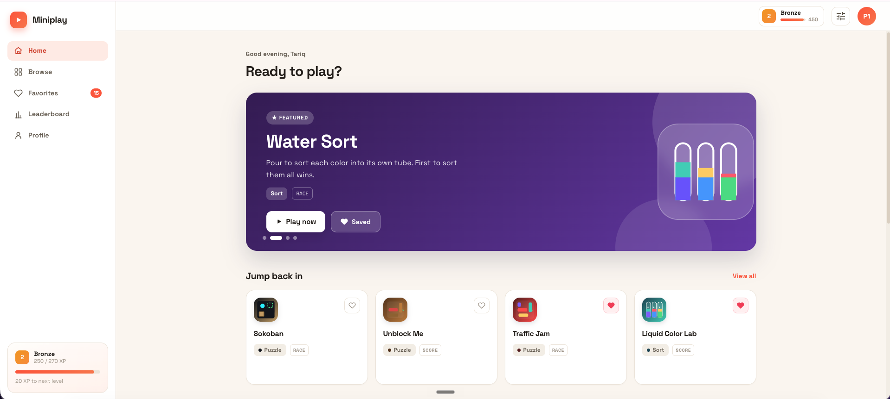

# No WiFi Games



A modern, installable, **fully offline** mini-games web app where **2 players** can play
together — pass-and-play with a friend or against a bot. Built to scale to **100+ games**:
adding a game is a drop-in folder plus one registry line.

## Features
- **Offline-first PWA** — installable, runs with no network (service worker precache).
- **Three contest types** handled by a shared engine:
  - `race` — both players solve the same seeded puzzle on a split screen; first done wins.
  - `score` — alternating rounds on the same seed (pass-the-device); highest score wins.
  - `table` — a single shared board the game manages (card games), you + bots or friends.
- **Play modes**: 1 Player, 2 Players (same device), vs Bot (easy / medium / hard).
- **55+ Offline Games** — including puzzle, card, board, arcade, word, and sorting games (see the [Available Games](#available-games) list below).
- Favorites, recent/continue, and high scores persisted to `localStorage`.

## Available Games
We currently feature **55 games** across various categories:

| Game | Category | Mode / Contest | Description |
| :--- | :--- | :--- | :--- |
| **Color Cards** | Card | Table | Match color or number, dump your hand first. UNO-style chaos vs friends or bots. |
| **Water Sort** | Sort | Race | Pour to sort each color into its own tube. First to sort them all wins. |
| **Color Blocks** | Puzzle | Race | Drop blocks, clear full lines. Outlast your rival before the grid fills up. |
| **Nuts and Bolts** | Sort | Race | Stack matching nuts onto bolts until each is one solid color. Fastest sorter wins. |
| **Maze Paint** | Puzzle | Race | Slide to fill every tile in one continuous stroke. First to paint the maze wins. |
| **Word Finder** | Word | Score | Swipe the letter wheel to build words. Highest score after both rounds wins. |
| **2048** | Puzzle | Score | Swipe to merge matching tiles and chase the biggest number. Beat the bot’s score. |
| **Block Blast** | Puzzle | Score | Drop blocks, clear lines, and chain combos for a huge score. Outscore your rival. |
| **Traffic Jam** | Puzzle | Race | Slide the cars out of the way to free the red car. First to clear the jam wins. |
| **Memory Match** | Puzzle | Table | Flip cards to find pairs. Match to go again — most pairs wins. Play a friend or bot. |
| **Tic-Tac-Toe** | Board | Table | Three in a row to win. Face an unbeatable bot or a friend pass-and-play. |
| **Dots & Boxes** | Board | Table | Draw lines, close boxes, take extra turns. Claim the most boxes to win. |
| **Secret Word** | Word | Score | Guess the hidden 5-letter word in six tries. Race the bot to crack it first. |
| **Pipe Mania** | Puzzle | Race | Rotate the pipes to connect the water 💧 to the flower 🌸. First to connect wins. |
| **Flow Free** | Puzzle | Race | Connect matching dots and fill the whole grid without crossing lines. Race to finish. |
| **Mancala** | Board | Table | Sow seeds around the board, capture your opponent’s, and fill your store to win. |
| **Reversi** | Board | Table | Flank your opponent’s discs to flip them. Own the most of the board to win. |
| **Golf Solitaire** | Card | Score | Clear the columns by playing cards one higher or lower than the waste. Beat the bot. |
| **Sudoku 6×6** | Puzzle | Score | Fill the 6×6 grid so every row, column and box has 1–6. Race the bot to solve it. |
| **Knife Hit** | Arcade | Score | Tap to throw knives into the spinning log — just don’t hit another knife! |
| **Flood-It** | Sort | Race | Flood the board from the corner and turn every tile one color. First to fill wins. |
| **Nonogram** | Puzzle | Race | Use the number clues to reveal the hidden pixel-art. Race the bot to solve it. |
| **Peg Solitaire** | Board | Score | Jump pegs to remove them and aim to leave just one. Outlast the bot. |
| **Battleship** | Board | Table | Hunt and sink the enemy fleet before they sink yours. Vs bot or pass-and-play. |
| **Simon Says** | Arcade | Score | Watch the flashing pattern and repeat it. Each round gets longer — how far can you go? |
| **Whack-a-Mole** | Arcade | Score | Tap the moles before they duck — but dodge the bombs! Most points in 30s wins. |
| **BlockuDoku** | Puzzle | Score | Drop blocks to fill rows, columns and 3×3 zones. Chain clears for combo points. |
| **Minesweeper** | Board | Score | Reveal safe cells using the number clues, flag the mines. Race the bot to clear it. |
| **Mahjong Mini** | Board | Score | Match free tiles open on a side to clear the layered board. Most pairs wins. |
| **Goods Match** | Sort | Score | Tap items into the tray and match 3 to clear. Don’t overflow the tray! |
| **Hexa Sort** | Sort | Score | Drop color stacks onto the hex grid; matching neighbors merge and pop when full. |
| **Screw Jam** | Sort | Score | Unscrew the pins into matching boxes — fill a box of three to clear it. |
| **Helix Jump** | Arcade | Score | Spin the tower so the ball drops through every gap. How deep can you go? |
| **Eat & Grow** | Arcade | Score | Drag the hole and swallow everything smaller to grow. Devour the most in 40s. |
| **Brick Breaker** | Arcade | Score | Aim and fire a stream of balls to smash the descending numbered blocks. |
| **Tower War** | Arcade | Table | Grow troops and drag attacks between towers to capture them all. Real-time vs a bot. |
| **Unblock Me** | Puzzle | Score | Slide the wooden blocks aside to free the key block out the gap. Fewer moves = higher score. |
| **Liquid Color Lab** | Sort | Score | Pour and sort the bubbling chemicals into matching test tubes. Beat the bot’s solve. |
| **Tile Match 3D** | Sort | Score | Tap free tiles from the pile and collect three of a kind before time runs out. |
| **Word Wipe** | Word | Score | Swipe touching letters to spell words and collapse the grid. Most points in 75s wins. |
| **Checkers** | Board | Table | Classic draughts — capture by jumping, crown your kings. Vs bot or pass-and-play. |
| **Hexa Puzzle** | Puzzle | Score | Drop hexagon pieces onto the board and fill full lines on any of three axes to clear them. |
| **Merge Defense** | Arcade | Score | Fire number tiles up the lanes to wipe out descending enemies before they reach your base. |
| **Neon Tunnel** | Arcade | Score | Steer your ship through the neon tunnel, dodging obstacles for as long as you can. |
| **Stack Jump** | Arcade | Score | Tap to drop each sliding block — line it up perfectly to build the tallest tower. |
| **Arrow Escape** | Puzzle | Race | Tap arrows to slide them off the board — clear a path for each one and empty the grid first. |
| **Black Hole** | Card | Score | Swallow the whole table into the black hole — play cards one rank up or down, no suits, no luck. |
| **Dungeon Sweeper** | Puzzle | Score | Minesweeper with monsters. Read the numbers, grab the loot, and reach the exit before your HP runs out. |
| **Magnetic Pull** | Arcade | Score | Hold the magnets to steer a steel ball down a tightening corridor. How far can you roll? |
| **Perfect Slice** | Puzzle | Score | Cut the shape into perfectly equal pieces with a limited number of straight slices. |
| **Word Ladder** | Word | Race | Change one letter at a time to climb from the start word to the goal. First to the top wins. |
| **Chess** | Board | Table | The timeless game of kings. Castle, promote, and hunt the checkmate. Vs bot or pass-and-play. |
| **Flappy Bird** | Arcade | Score | Tap to flap the bird between the pipes. One touch is all it takes — how far can you fly? |
| **Hangman** | Word | Score | Guess the hidden word one letter at a time before the stick figure is complete. |
| **Klondike Solitaire** | Card | Score | The classic patience. Build the foundations Ace to King by suit. Beat the bot’s tally. |

## Stack
React 18 · TypeScript · Vite · `vite-plugin-pwa` · zustand · react-router · Vitest.

## Develop
```bash
npm install
npm run dev        # http://localhost:5173
npm run build      # type-check + production build + service worker
npm run preview    # serve the production build (test offline here)
npm run test       # unit tests (engine + game logic)
```

## Architecture
```
src/
  engine/      Game contract (types.ts), GameHost (race/score/table), match, rng
  games/       registry.ts (catalog) + one self-contained folder per game
  pages/       Home, Library (search/filter), GamePage (mode picker)
  components/   GameTile, TopBar, ResultModal, ProgressBar
  store/       persisted favorites / scores / settings (zustand)
```

### Adding a game (the path to 100+)

#### Option A: Using the Automated `add-game` Skill (Recommended)
If you are developing this with Claude or an agentic assistant supporting custom skills, you can use the `add-game` skill to automate scaffolding. Simply request the assistant to run it:
```bash
/add-game <GameName>: <GameBrief>
```
For example:
```bash
/add-game Snake: classic snake; Sokoban: push boxes onto targets
```
This automatically scaffolds the game logic, UI component, bot logic, SVG icon, registry entry, CSS styles, and unit tests, then verifies that the project compiles cleanly.

#### Option B: Manual Scaffolding
1. Create `src/games/<id>/index.tsx` exporting a `GameModule` as default:
   - a **Solo** component (`race`/`score`) — plays one seeded puzzle for one seat, and
     drives its own bot when `isBot` is true; or
   - a **Table** component (`table`) — manages the whole multiplayer board.
2. Add tile art to `src/games/icons.tsx`.
3. Append one entry to `src/games/registry.ts`.
4. Define game styles in `src/games/games.css`.
5. Add unit/logic tests to `src/games/__tests__/`.

After doing this, the game automatically appears on the Home page and Library, gaining routing, the mode picker, the 2-player wrapper, scoring, and results.

## Offline verification
`npm run build && npm run preview`, load once, then set DevTools → Network → **Offline**
and reload — the shell and any loaded game keep working. The "Install app" prompt appears
in supported browsers.
